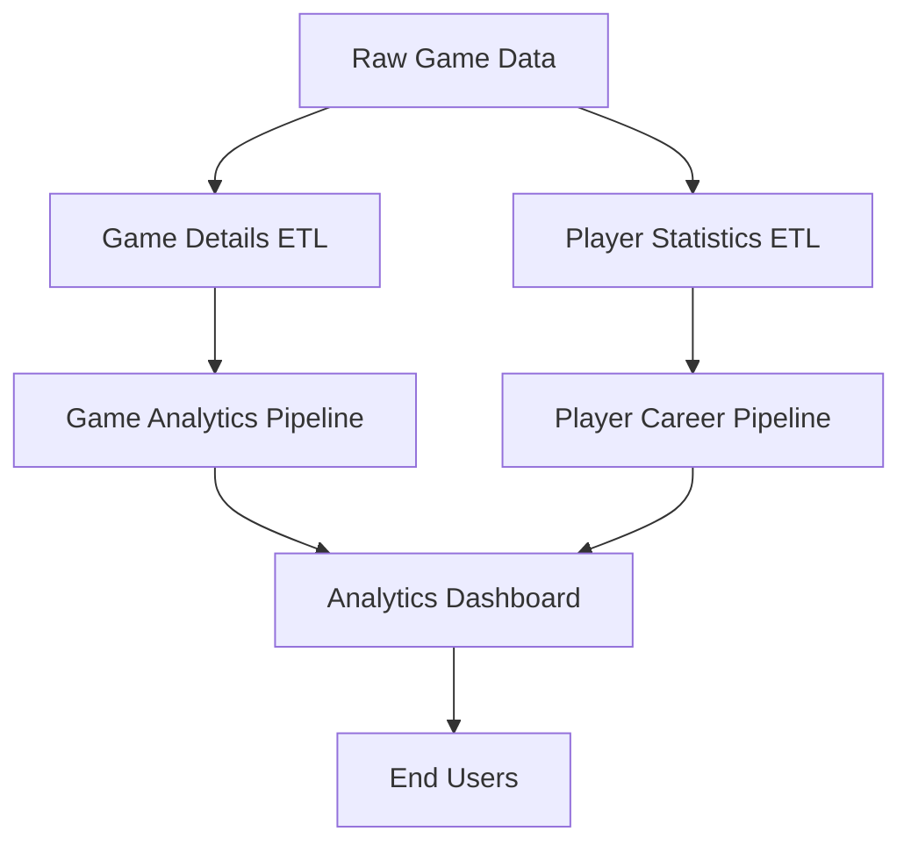

# NBA Analytics Pipeline Management

## System Architecture Overview

### Data Flow

## Pipeline Components

### 1. Data Ingestion Layer
- Raw game data ingestion (real-time)
- Player statistics collection (daily)
- Team reference data updates (weekly)
- Historical data backfills (as needed)

### 2. Processing Layer
- Game details transformation
- Player career tracking
- Team performance analytics
- Statistical aggregations

### 3. Analytics Layer
- Real-time game statistics
- Historical trend analysis
- Player career progression
- Team performance metrics

## Maintenance Procedures

### Daily Operations
1. Monitor pipeline health
2. Verify data freshness
3. Review alert logs
4. Update documentation
5. Perform data quality checks

### Weekly Tasks
1. Review performance metrics
2. Update reference data
3. Validate historical data
4. Team status meeting
5. Update runbooks

### Monthly Tasks
1. Capacity planning review
2. Performance optimization
3. Security audit
4. Backup verification
5. Documentation review

## Incident Management

### Severity Levels
1. **P0 - Critical**
   - Service outage
   - Data corruption
   - Real-time data flow blocked
   
2. **P1 - High**
   - Significant delay
   - Partial data loss
   - Performance degradation
   
3. **P2 - Medium**
   - Minor delays
   - Non-critical features affected
   - Warning thresholds exceeded
   
4. **P3 - Low**
   - Cosmetic issues
   - Minor inconsistencies
   - Documentation updates needed

### Response Procedures
1. Incident Detection
2. Initial Assessment
3. Team Notification
4. Investigation
5. Resolution
6. Post-mortem
7. Documentation Update

## Quality Assurance

### Data Quality Metrics
1. Completeness
2. Accuracy
3. Timeliness
4. Consistency
5. Reliability

### Monitoring Tools
1. Datadog
2. PagerDuty
3. Airflow
4. Custom dashboards
5. Alert systems

## Disaster Recovery

### Backup Procedures
1. Daily snapshots
2. Weekly full backups
3. Monthly archive
4. Yearly consolidated backup

### Recovery Procedures
1. Identify failure point
2. Assess data loss
3. Execute recovery plan
4. Validate restored data
5. Resume operations

## Documentation Standards

### Required Documentation
1. Technical specifications
2. Data dictionaries
3. Pipeline diagrams
4. Recovery procedures
5. Validation scripts

### Update Procedures
1. Regular reviews
2. Version control
3. Change tracking
4. Approval process
5. Distribution plan

## Training and Knowledge Transfer

### Required Training
1. System architecture
2. Tool proficiency
3. Alert handling
4. Recovery procedures
5. Documentation practices

### Knowledge Base
1. Common issues
2. Resolution steps
3. Best practices
4. Tool guides
5. FAQ repository

## Continuous Improvement

### Review Cycles
1. Weekly team reviews
2. Monthly metrics analysis
3. Quarterly planning
4. Annual architecture review

### Improvement Areas
1. Performance optimization
2. Cost reduction
3. Reliability enhancement
4. Process automation
5. Documentation updates 